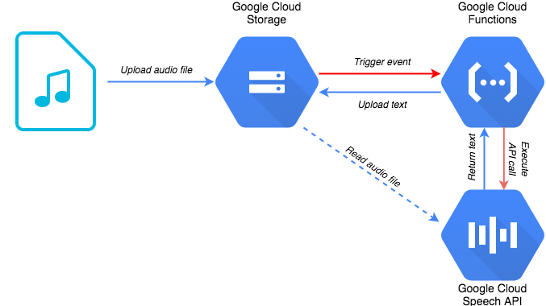

# speech-2-srt


https://cloud.google.com/community/tutorials/speech2srt


#  Env Setup

```
git clone https://github.com/GoogleCloudPlatform/community.git

```
```
cd community/tutorials/speech2srt
```
```
python3 -m venv venv
```
```
source venv/bin/activate
```


```

**new add line**

pip install -I https://github.com/pypa/pip/archive/master.zip#egg=pip


`pip install --upgrade setuptools`


```

```
pip3 install -r requirements.txt
```


#  HELP 

```
python3 speech2srt.py -h
```

```
usage: speech2srt.py [-h] [--storage_uri STORAGE_URI]
                     [--language_code LANGUAGE_CODE]
                     [--sample_rate_hertz SAMPLE_RATE_HERTZ]
                     [--out_file OUT_FILE] [--max_chars MAX_CHARS]

optional arguments:
  -h, --help            show this help message and exit
  --storage_uri STORAGE_URI
  --language_code LANGUAGE_CODE
  --sample_rate_hertz SAMPLE_RATE_HERTZ
  --out_file OUT_FILE
  --max_chars MAX_CHARS

```


#  Test


```
python3 speech2srt.py --storage_uri ./example.wav  --sample_rate_hertz 24000
```

